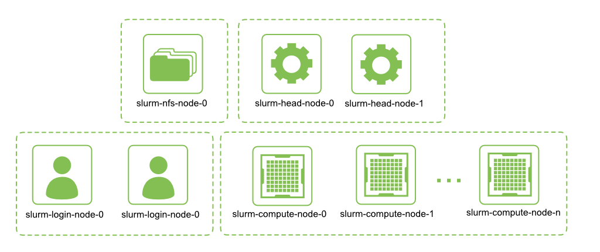

# SLURM
This repository is the simplest way to create a high-availability
[SLURM](https://slurm.schedmd.com/quickstart.html) cluster on Crusoe Cloud.
To get started, create a file named `terraform.tfvars` with the cluster
parameters. For example `.tfvars` files, see the `examples` directory.
```
terraform init
terraform apply
```

## What is provided by the cluster?


By default, this solution will create a high-availability SLURM cluster with:
* 2 `c1a.16x` head nodes
* 2 `c1a.16x` login nodes
* 1 `s1a.80x` nfs node
* n compute nodes of any instance type.

## NFS storage
The `slurm-nfs-node-0` node exports a `/home` directory that is mounted by all login nodes and
all compute nodes. 

The `slurm_nfs_node_type` variable can optionally be set in the `terraform.tfvars` file
to configure the instance type used to create `slurm-nfs-node-0`. If left unconfigured,
this will default to `s1a.80x`.

The `slurm_nfs_home_size` variable can optionally be set in the `terraform.tfvars` file
to configure the size of the `/home` nfs share. If left unconfigured, this will default
to 10 TiB. Note that `10 TiB` is the maximum currently supported by Crusoe Cloud.

## Enroot and Pyxis
This solution provides support for [NVIDIA Enroot](https://github.com/nvidia/enroot)
and [Pyxis](https://github.com/NVIDIA/pyxis). On all
[instance types with local ephemeral disks](https://docs.crusoecloud.com/compute/virtual-machines/overview/index.html),
the disks are combined with `raid 0`, formatted with an `ext4` filesystem, and mounted
at `/raid0`. This can serve as a scratch space for enroot images.

## How do I handle a head node outage?
This solution utilizes a secondary head-node that will take over within 10
seconds if the primary head-node stops responding. As long as at least one
head-node is still responsive, the cluster will remain usable.

## How do I handle a nfs node outage?
Note that NFS is not deployed in a high-availability configuration.
If `slurm-nfs-node-0` goes down, then none of the login nodes or compute
nodes will be able to mount the `/home` directory. This will prevent users
from logging in to any `slurm-login-node` or `slurm-compute-node`. The cluster
will recover gracefully once `slurm-nfs-node-0` is brought back online. 
During this time, it is still possible to login to any of the nodes as
the `root` user.

## How do I handle a login node outage?
If one of the login nodes goes offline, the other login nodes will remain
fully functional. As long as cluster users store data in their home directory,
which is backed by a nfs share, they should be able to ssh into another login
node and continue using the cluster.

## How do I handle a compute node outage?
When a compute node is rebooted or stops responding for more than 5 minutes,
it will be marked as `DOWN`.

```bash
sinfo
PARTITION AVAIL  TIMELIMIT  NODES  STATE NODELIST
batch*       up   infinite      1  down* slurm-compute-node-0
batch*       up   infinite      7   idle slurm-compute-node-[1-7]
```

Once the compute node is back online, the following command can be used to return
it to the cluster.
```bash
sudo scontrol update NodeName=slurm-compute-node-0 State=RESUME
```

Once the compute node has been returned to the cluster, it should enter an `IDLE` state.
```bash
sinfo
PARTITION AVAIL  TIMELIMIT  NODES  STATE NODELIST
batch*       up   infinite      8   idle slurm-compute-node-[0-7]
```
