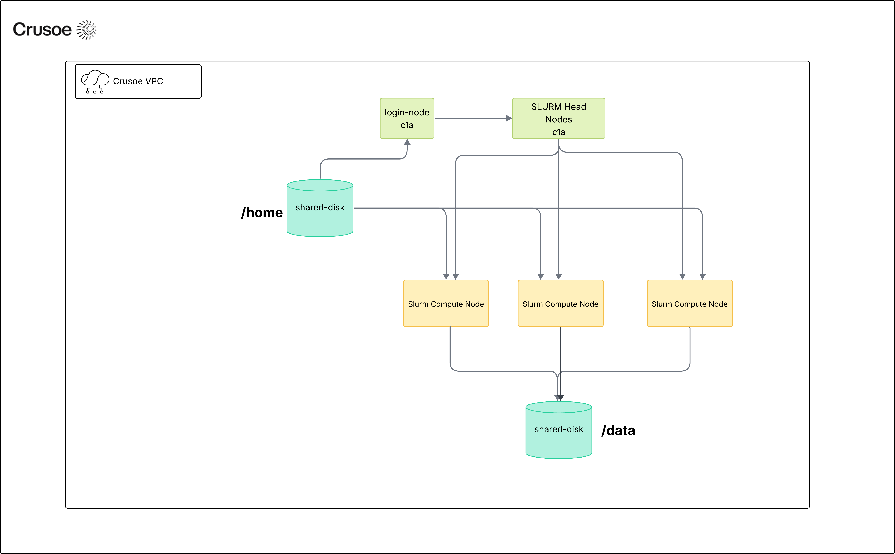

# SLURM v2
This repository is the simplest way to create a high-availability
[SLURM](https://slurm.schedmd.com/quickstart.html) cluster on Crusoe Cloud.
To get started, create a file named `terraform.tfvars` with the cluster
parameters. For example `.tfvars` files, see the `examples` directory.
```
terraform init
terraform apply
```

## What is provided by the cluster?


By default, this solution will create a high-availability SLURM cluster with:
* 2 `c1a.16x` head nodes
* 2 `c1a.16x` login nodes
* Crusoe NFS Shared Disk for shared home directory
* Crusoe NFS Shared Disk for shared data directory (either new or importing an existing disk)
* Crusoe NFS Shared Disk for persisting Slurm controller state 
* n compute nodes of any instance type.

***Note:*** Currently the following Crusoe compute node instance types are supported: 
- NVIDIA GB200 NVL72 (`gb200-186gb-nvl-ib.4x`,`gb200-186gb-nvl.4x`)
- NVIDIA B200 (`b200-180gb-sxm-ib.8x`)
- NVIDIA H200 (`h200-144gb-sxm-ib.8x`)
- NVIDIA H100 (`h100-80gb-sxm-ib.8x`)
- NVIDIA A100 (`a100-80gb-sxm-ib.8x`)

## Storage

This solution currently supports three tiers of storage:

### Local Scratch
Each `slurm-compute-node` instance supports local scratch storage, and the size depends on the instance type. If present, scratch storage is located at `/scratch/local`.  The local scratch storage is erased whenever the compute node is stopped.

The local scratch size on common compute node instance types are:
* `gb200-186gb-nvl-ib.4x`,`gb200-186gb-nvl.4x`: 7.68TB
* `b200-180gb-sxm-ib.8x`: 15.32TB 
* `h200-144gb-sxm-ib.8x`: 15.32TB 
* `h100-80gb-sxm-ib.8x`: 7.68TB
* `a100-80gb-sxm-ib.8x`: 7.68TB

### Shared Home Directory
The `slurm-nfs-home-disk` node exports a persistent `/home` directory that is mounted using NFS by all login nodes and all compute nodes. It uses the Crusoe [Shared Disk](https://docs.crusoecloud.com/storage/disks/managing-shared-disks/index.html) powered by VAST.

The `slurm_shared_disk_nfs_home_size` variable can optionally be set in the `terraform.tfvars` file to configure the size of the `/home` nfs share. If left unconfigured, this will default to 20 TiB.

***Note:*** The lifecycle of the shared home directory is tied to the lifecycle of the cluster. Deleting the cluster will delete the shared home directory. 

### Shared Data Directory

You can also create a Shared Data directory called `slurm-data-disk`, also mounted to all the login nodes and all compute nodes via NFS. It also uses Shared Disk. You can set the size of the disk using `slurm_data_disk_size`, or let it default to 1000TiB. The disk will mount, by default, to `/data`.

If you have an existing Shared Disk you want to use as Shared Data directory, provide its disk ID using the `pre_existing_slurm_data_disk_id` variable. (This will ignore any new shared data directory variables such as `slurm_data_disk_size` from above) This is the recommended way to add high-performance persistent file storage to your cluster, if you want to persist data outside the lifecycle of the slurm cluster.

## Features

### User Management
To add additional users to your cluster, configure the `slurm_users` variable in your
`terraform.tfvars` file and run `terraform apply`. The following example adds three
additional users `user1`, `user2`, and `user3` to the slurm cluster.
```
# slurm users configuration
slurm_users = [{
  name = "user1"
  uid = 1001
  ssh_pubkey = "ssh-ed25519 AAAAC3NzaC1lZDI1NTE5AAAAIIjPRr0iVR4mgzJy0ehnM5hWX4O86hM1bVTgdi5g3nkZ user1@crusoe.ai"
}, {
  name = "user2"
  uid = 1002
  ssh_pubkey = "ssh-ed25519 AAAAC3NzaC1lZDI1NTE5AAAAIIjPRr0iVR4mgzJy0ehnM5hWX4O86hM1bVTgdi5g3nkZ user2@crusoe.ai"
}, {
  name = "user3"
  uid = 1003
  ssh_pubkey = "ssh-ed25519 AAAAC3NzaC1lZDI1NTE5AAAAIIjPRr0iVR4mgzJy0ehnM5hWX4O86hM1bVTgdi5g3nkZ user3@crusoe.ai"
}]
```

### Enroot and Pyxis
This solution provides support for [NVIDIA Enroot](https://github.com/nvidia/enroot)
and [Pyxis](https://github.com/NVIDIA/pyxis).
```
srun --container-image=<image> <cmd>
```
**Note**: This solution stores any enroot cache data under `/scratch/local/enroot`.


### MPI

*Note*: PMIx is currently not supported on GB200.

This solution includes PMIx support for running Open MPI applications.
```
srun --mpi=pmix <cmd>
```

For example, this can be used to run the nccl-tests included in the `ubuntu22.04-nvidia-slurm` image.
```
# Run 2-node NCCL AllReduce Benchmark using RDMA Transport.
export NCCL_IB_HCA=^mlx5_0:1
srun -N 2 --ntasks-per-node=8 --gres=gpu:8 --cpus-per-task=22 --mpi=pmix /opt/nccl-tests/build/all_reduce_perf -b 1M -e 1G -f 2 -g 1

# Run 2-node NCCL AllReduce Benchmark using Ethernet Transport.
export NCCL_IB_DISABLE=1
export NCCL_IBEXT_DISABLE=1
srun -N 2 --ntasks-per-node=8 --gres=gpu:8 --cpus-per-task=22 --mpi=pmix /opt/nccl-tests/build/all_reduce_perf -b 1M -e 1G -f 2 -g 1
```

### Observability

The slurm solution comes pre-packaged with dashbords displaying VM utilization metrics such as CPU usage, and GPU metrics based off of `dcgm-exporter`. You will only get observability if you set the `enable_observability` variable to true. You can set the `grafana_admin_password` variable, but if you don't, it will default to `admin`. The solution will also add a firewall rule to ensure you can access the dashboard.

The dashboard will be exposed from the headnode as a server using port 3000. Simply type in the following in your browser to access the dashboard:

`https://<Head Node IP>:3000`

### GB200 Support

The slurm solution provides GB200 NVL72 support via configuration of IMEX and Slurm native Block Topology. 

IMEX can be enabled via the variable `enable_imex_support` (set to true). 

In order the configure Block Topology, you will need to do the following:

1. Generate a JSON file that lists all of your running GB200 VMs in your Crusoe Project: `crusoe compute vms list --types gb200-186gb-nvl-ib.4x --states STATE_RUNNING -f json > slurm.json`
2. Create the tpology configuration file (topology.conf) by running the python file in this directory: `python3 topology.py slurm.json`
3. SSH into the Head Node, and un-comment this line in `/etc/slurm.conf`: `TopologyPlugin=topology/block`
4. Copy the topology.conf file generated in step 1 under `/etc/slurm/topology.conf`
5. Reconfigure your slurm cluster: `sudo -i scontrol reconfigure`
6. Verify the topology: `scontrol show topology`. This will show the block topology definition similar to the following:

```
ubuntu@slurm-head-node-0:~$ scontrol show topology
BlockName=block01 BlockIndex=0 Nodes=slurm-compute-node-[000-017] BlockSize=18
BlockName=block02 BlockIndex=1 Nodes=slurm-compute-node-[018-035] BlockSize=18
BlockName=block03 BlockIndex=2 Nodes=slurm-compute-node-[036-053] BlockSize=18
BlockName=block04 BlockIndex=3 Nodes=slurm-compute-node-[054-071] BlockSize=18
BlockName=block05 BlockIndex=4 Nodes=slurm-compute-node-[072-089] BlockSize=18
BlockName=block06 BlockIndex=5 Nodes=slurm-compute-node-[090-107] BlockSize=18
BlockName=block07 BlockIndex=6 Nodes=slurm-compute-node-[108-125] BlockSize=18
BlockName=block08 BlockIndex=7 Nodes=slurm-compute-node-[126-143] BlockSize=18
BlockName=block09 BlockIndex=8 Nodes=slurm-compute-node-[144-161] BlockSize=18
BlockName=block10 BlockIndex=9 Nodes=slurm-compute-node-[162-179] BlockSize=18
```

## Troubleshooting

### How do I handle a head node outage?
This solution utilizes a secondary head-node that will take over within 10
seconds if the primary head-node stops responding. As long as at least one
head-node is still responsive, the cluster will remain usable.

### How do I handle a login node outage?
If one of the login nodes goes offline, the other login nodes will remain
fully functional. As long as cluster users store data in their home directory,
which is backed by a nfs share, they should be able to ssh into another login
node and continue using the cluster.

### How do I handle a compute node outage?
When a compute node is rebooted or stops responding for more than 5 minutes,
it will be marked as `DOWN`.

```bash
sinfo
PARTITION AVAIL  TIMELIMIT  NODES  STATE NODELIST
batch*       up   infinite      1  down* slurm-compute-node-0
batch*       up   infinite      7   idle slurm-compute-node-[1-7]
```

Once the compute node is back online, it will automatically rejoin the
cluster as long as it is healthy.

Once the compute node has been returned to the cluster, it should enter an `IDLE` state.
```bash
sinfo
PARTITION AVAIL  TIMELIMIT  NODES  STATE NODELIST
batch*       up   infinite      8   idle slurm-compute-node-[0-7]
```
